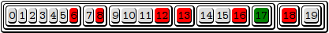

# Collection

## 0.1 Rube Goldberg release

This library implements persistent datastructures for Rust, with 
efficient, with the complexity of the union operation can be sublinear 
in practical cases.

## Deterministically balanced search trees
This is achieved by using deterministically balanced trees, where the 
split-points of the tree are determined by the `Weight` of the elements
in the collection.

That T implements Weight, means that `T`, or parts of `T` can be Hashed
this hash is then used to determine the weight, essentialy by counting 
leading zeroes in the hash. The weight then determines how many levels to
split.



## Copy on write, and structural sharing
Cloning a collection is a constant time operation. This is achieved by
the Stash abstraction, which keeps a collection of Nodes, referenced by 
a `Location` indirection.

## Pluggable metadata
Each collection can carry different kinds of metadata, metadata is defined
as the operations `&T -> Meta<T>`, and a binary operation combining
two `Meta<T>` with each other. So, to implement a Set, you would use
`Max<T>`, and if you also want constant-time equality checking, you would
add `CheckSum<T>`

## Collection types

Collection comes with 3 pre-defined sets of operations making up a Set, a Vector, and a Map.

To define a collection, you use the `collection!` macro:

```rs
    collection!(Set<T> {
        max: Max<T>,
        checksum: CheckSum<u64>,
    } where T: Ord + Hash);

    collection!(Vector<T> {
        cardinality: Cardinality<usize>,
        checksum: CheckSum<u64>,
    } where T: Hash);

    collection!(Map<T> {
        key: Key<T::Key>,
        keysum: KeySum<u64>,
				valsum: ValSum<u64>,
    } where T: Keyed, 
            T::Key: Hash,
            T::Value: Hash);				
```

## License
GPLv3